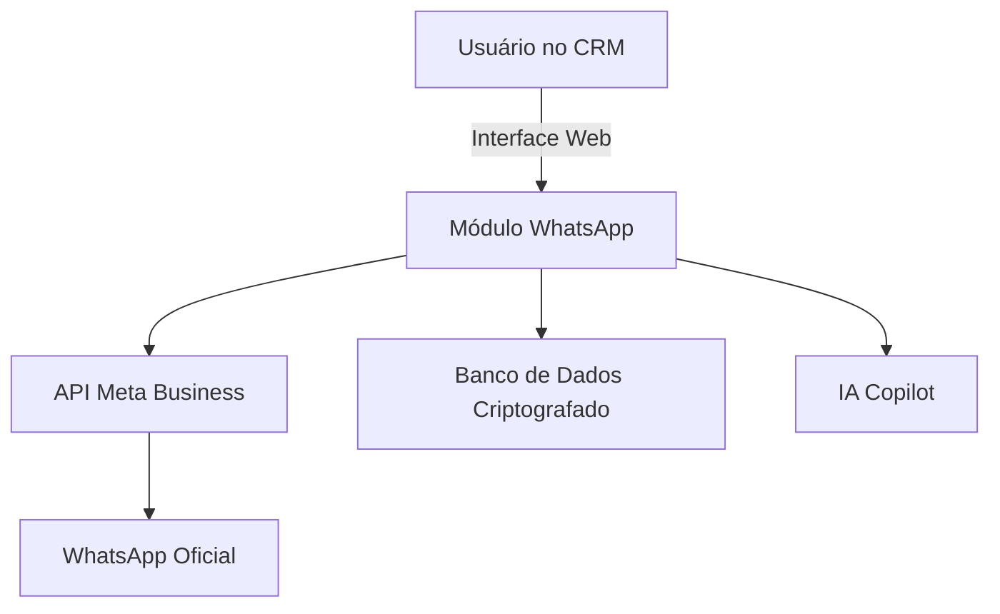

# 📦 Plano do Módulo WhatsApp para CRM

## 🎯 Objetivo
Criar um módulo integrado ao CRM para comunicação via WhatsApp utilizando a **API oficial da Meta**, garantindo **segurança total**, **IA Copilot** para atendimento inteligente e uma **interface moderna**. O objetivo é superar soluções atuais do mercado com controle interno e escalabilidade.

---

## 🏗 Arquitetura Geral


**Componentes:**
- **Frontend:** React/Vue integrado ao CRM.
- **Backend:** Node.js ou Python (FastAPI/Flask).
- **Banco de Dados:** PostgreSQL/MongoDB.
- **IA:** Copilot via API.
- **Segurança:** HTTPS, JWT, criptografia AES.

---

## ✅ Checklist de Recursos
| Categoria | Gratuito | Pago |
|-----------|----------|------|
| Framework Frontend | React, Vue | - |
| Backend | Node.js, Python | - |
| Banco de Dados | PostgreSQL, MongoDB | - |
| Hospedagem | VPS (Linux) | - |
| API WhatsApp | - | Meta Business API |
| IA Copilot | - | API Copilot |

---

## 🔗 Integração com API Meta
**Passos:**
1. Criar conta no [Meta Business](https://business.facebook.com/).
2. Gerar **Access Token**.
3. Configurar **Webhook** para receber mensagens.
4. Implementar endpoints:
   - `POST /send-message`
   - `GET /receive-message`

Exemplo de envio:
```python
import requests
url = "https://graph.facebook.com/v17.0/<PHONE_NUMBER_ID>/messages"
headers = {"Authorization": "Bearer <ACCESS_TOKEN>", "Content-Type": "application/json"}
data = {"messaging_product": "whatsapp", "to": "<CLIENT_NUMBER>", "text": {"body": "Olá!"}}
requests.post(url, headers=headers, json=data)
```

---

## 🔒 Segurança e LGPD
- Criptografia AES para dados sensíveis.
- Autenticação OAuth2/JWT.
- Logs auditáveis.

---

## 🤖 IA Copilot
**Funções:**
- Respostas automáticas inteligentes.
- Sugestões para atendentes.
- Análise de sentimento.
- Geração de respostas rápidas.

---

## 🎨 Interface Visual
**Mockup:**
```
[ Painel CRM ]
 ├── Conversas WhatsApp
 │    ├── Lista de chats
 │    ├── Caixa de resposta + IA Sugestões
 │    └── Botão "Transferir para humano"
```
Ícone sugerido: balão verde com engrenagem.

---

## 📂 Estrutura do Banco de Dados
**Tabelas:**
- `users`: id, nome, email, permissões.
- `contacts`: id, nome, telefone, tags.
- `messages`: id, contato_id, texto, tipo, status, timestamp.

---

## 📅 Roadmap de Desenvolvimento
1. Configuração API Meta.
2. Backend para envio/recebimento.
3. Banco de dados seguro.
4. Painel no CRM.
5. IA Copilot integrada.
6. Métricas e relatórios.

---

## 💡 Ideias Avançadas
- Chatbot híbrido (IA + humano).
- Agendamento automático.
- Tradução automática.
- Conversão de áudio em texto.

---

## 🌐 Como Criar e Configurar a API Oficial da Meta (WhatsApp)

### ✅ Passos para Habilitar a API
1. **Criar conta no Meta Business Manager**  
   Acesse: [https://business.facebook.com/](https://business.facebook.com/)

2. **Registrar um WhatsApp Business Account (WABA)**  
   - Vincule um número exclusivo para WhatsApp Business.
   - Valide via SMS ou chamada.

3. **Criar um App no Meta for Developers**  
   - Acesse: [https://developers.facebook.com/](https://developers.facebook.com/)
   - Adicione o produto **WhatsApp**.

4. **Gerar Credenciais**  
   - **Access Token** (temporário ou permanente).
   - **Phone Number ID**.
   - **Business Account ID**.

5. **Configurar Webhook**  
   - Crie um endpoint no seu servidor (ex.: `/webhook`).
   - Registre a URL no painel do Meta.
   - Valide com o token fornecido.

### ✅ Custos
- A API oficial é **paga por sessão de conversa**.
- Não há custo para criar a conta, apenas por uso.

### ✅ Exemplo de Requisição
```python
import requests
url = "https://graph.facebook.com/v17.0/<PHONE_NUMBER_ID>/messages"
headers = {
    "Authorization": "Bearer <ACCESS_TOKEN>",
    "Content-Type": "application/json"
}
data = {
    "messaging_product": "whatsapp",
    "to": "<CLIENT_NUMBER>",
    "text": {"body": "Olá! Esta é uma mensagem via API oficial."}
}
response = requests.post(url, headers=headers, json=data)
print(response.json())
```

### ✅ Recursos Oficiais
- [Documentação Meta WhatsApp API](https://developers.facebook.com/docs/whatsapp)

---
